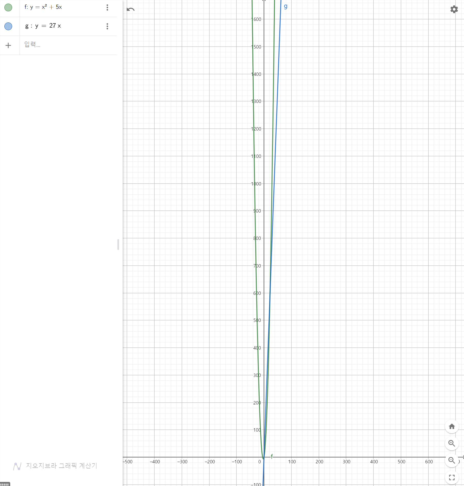
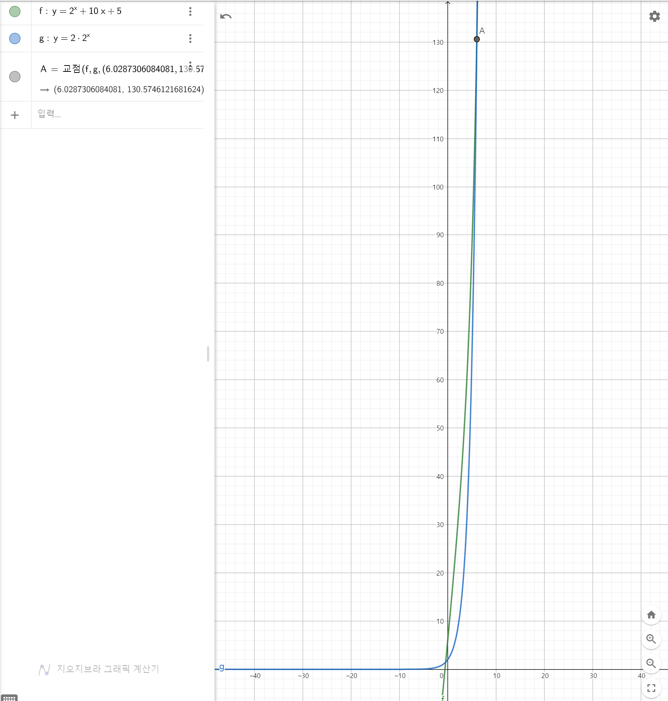

## ✏️ Problem Solving이란?

그대로 번역하면 문제를 해결하는 것, 문제를 해결하는 방법을 찾는 것이다.  
문제를 해결하기 위해서는 절차가 있고 그 절차/알고리즘을 설계하는 것을 말한다.

### 풀어야 하는 문제들

1. 입력과 출력이 정의된 `적당한` 문제가 주어짐
2. 입력을 넣었을 때 올바른 결과를 출력하는 프로그램을 작성
3. `시간제한`과 `메모리 제한`이 있음
4. 대회 등에서는 정해진 시간 동안에 여러 문제를 빠르게 풀어야 한다

### `적당한` 문제가 뭘까?

- 문제에 나와있는 내용을 그대로 구현하기
- 조건을 만족하는 최댓값/최솟값을 구하기
- 주어진 연산을 효율적으로 처리하기
- 주어진 작업을 하는데 필요한 최소/최대 비용 구하기
- 등등

### 문제를 해결하는 과정

- 자연어로 된 문제를 잘 읽는다
- 수학적으로 잘 모델링한다
- 풀이를 생각한다
- 내가 생각한 풀이가 맞는지 검증한다
- 내가 생각한 풀이를 코드로 옮긴다
- 제출한다(백준, CodeForce 등)
- 틀렸다면 왜 틀렸는지 고민한다
- (맞을 때까지 무한반복♾️)

결국엔 `수학적으로 잘 모델링 한다` 이부분이 매우 중요한 것이다.  
따라서 수학적/논리적인 사고가 필요하다.

### 이게 왜 필요하지? 개발에 도움이 되긴할까?

라는 생각이 든다면, 유튜브에서 스타트링크를 검색해 재생목록에서 첫번째 두번째 startlink.live를 들어보길 바란다. (스타트링크는 BOJ를 운영햐는 회사이다)

[](https://www.youtube.com/c/StartlinkIo/playlists)

## ⏱️ 시간 복잡도

### 알고리즘의 성능을 판단하는 몇가지 척도가 있다.

- 정확성: 얼마나 정확한 답을 구할 수 있는가?
- 작업량: 얼마나 적은 연산을 필요로 하는가?
- 메모리 사용량: 얼마나 적은 공간을 사용하는가? (요즘엔 메모리가 저렴해져서 우선순위는 낮다)
- 단순성: 알고리즘의 작동 과정이 얼마나 단순한가?
- 최적정: 더 이상 개선할 여지가 없을 만큼 최적화가 잘 되었나?

### 시간복잡도란?

#### 문제를 해결하는 데 `걸리는 시간`과 `입력 크기`의 관계를 나타내는 함수

- 연산이 많아질수록 오래 걸림
- PS에서는 네트워크 통신, CPU 점유 등은 신경 안 씀
- 연산을 몇 번 수행하는지 확인하면 수행 시간을 대략적으로 유추할 수 있음
- `최악의 경우`가 중요함 (문제 출제 시 최악의 경우까지 test를 함)

#### 시간 복잡도 측정 방법

문제를 해결하는데 필수적인 "기본연산"을 정의함
기본 연산의 "수행 횟수"를 Count

- 예1) 길이가 N인 배열에서 값이 K인 원소가 존재하지 확인
  - 기본 연산: 배열의 한 원소와 K값을 비교
  - 기본 연산의 수행 횟수: 최대 N회 (최소 1회)
  - 시간 복잡도: T(N)=N
- 예2) 길이 N인 배열에서 최댓값 찾기
  - 기본 연산: 배열의 두 원소의 값 비교
  - 기본 연산의 수행 횟수: 최대 N-1회
  - 시간 복잡도 T(N)=N-1

#### 함수에서 가장 중요한 정보

- <br>

  - x=1 : f(x)=6, g(x)=27
  - x=10 : f(x)=150, g(x)=270
  - x=100 : f(x)=10500, g(x)=2700
  - x=1000 : f(x)=1005000, g(x)=27000

  - 입력의 크기 x 가 커질수록 연산의 횟수를 증가함
  - 아래 그림처럼 특정 값 이후부터는 항상 f(x)가 g(x) 보다 크다. 입력의 크기가 커질수록 f(x)보다 g(x)가 더 적은 연산을 필요로 한다.
  - 

- 위 내용을 좀 더 수학적으로 나타내보면

  - x 가 적당히 큰 수라면 f(x) > g(x) 를 만족함
  - &space;x_{0}" style="background-color:#FFFFFF; display:inline;"/> 이면 항상 f(x) > g(x) 를 만족함
  - 입력이 커질수록 g(x) 가 더 좋은 복잡도이다

- 같은 원리로
  - 다항 함수: 최고차항의 차수가 중요
    - ex) 
    - x > 22 이면 항상 f(x) > g(x)
  - 지수 함수는 밑의 최댓값이 중요
    - ex) 
    - x > 4.6 이면 항상 f(x) > g(x)
  - 최고차항의 차수나 밑의 최댓값이 큰 함수가 더 크다.(=더 많은 연산을 필요로 한다.)
  - 지수 함수 vs 다항함수일 경우 지수함수가 더 크다
  - 우리는 최대한 다항식으로 동작하는 알고리즘을 찾아야 하고, 그중에서도 차수가 작은 알고리즘을 찾는 것이 중요!!

### 시간복잡도 표기법

#### Big-O Notation

- 방금 전 위에서 말했던 내용을 수학적으로 나타낸 것이 Big-O 표기법이다.

- 

  - 어떤 실수  와 양의 실수 c 가 있어서
  - &space;x_{0}" style="background-color:#FFFFFF; display:inline;"/> 을 만족하는 모든 x 에 대해
  -  를 만족한다.
  - 위 조건을 뜯어보자

- 어떤 실수  보다 큰 모든 
  - x 가 한 없이 커지면 항상 부등호가 성립
- 어떤 양의 실수 c
  - 최고차항의 계수 무시 (=어떤 함수의 상수배는 무시를 한다)
  - 결국엔 최고차항의 차수와 지수 항의 밑이 중요함
- Big-O Notation의 의미
  - f(x)가 아무리 빨리 증가해도
  - `최대` g(x)에 비례하는 수준으로 증가한다.
  - f(x)의 `상계`를 나타냄
  - 예를 들어보자
    - 
    -  이면 
    - 
    - f(x)와 c\*g(x) 의 교점은 6.0287...이다. 따라서  보다 큰 x 에 대해서 g(x)가 항상 f(x)보다 크다.

#### Big-Omega Notation

- Big-O Notation과 반대로 함수의 `하계`를 나타낸다

- <br>
  - 어떤 실수  와 양의 실수 c 가 있어서
  - &space;x_{0}" style="background-color:#FFFFFF; display:inline;"/> 을 만족하는 모든 x 에 대해
  -  를 만족한다.

#### Big-Theta Notation

- 상계와 하계의 교집합(Tight Bound)
- 

#### 극한을 이용한 표현

-  로 수렴
- 0" style="background-color:#FFFFFF; display:inline; vertical-align:middle"/>
-  로 수렴 (단, c > 0)

<!--
참고 사이트
https://github.com/zeuseyera/Markdown_TongDal-kr
https://latex.codecogs.com/
-->

```toc

```
